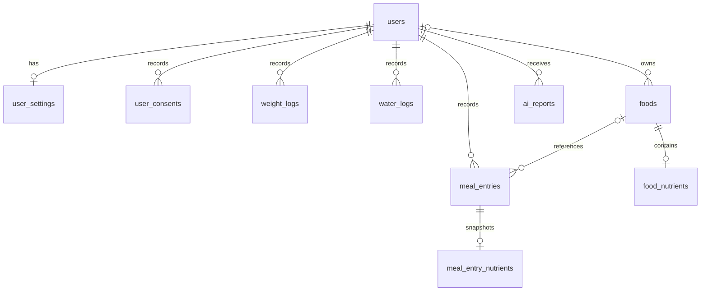

# YUM-YUM PostgreSQL 데이터베이스 설계안

React 프로젝트의 회원가입 및 Firebase 데이터 저장·조회 코드를 기준으로 정리한 설계안이다.
아래 테이블과 SQL은 제안이며, 이 문서 작성으로 DB에 테이블이 생성되지는 않는다.

## 설계 방향

- Firebase Authentication은 계정 관리와 ID 토큰 발급을 담당한다.
- Spring Security는 Firebase ID 토큰을 검증하고 API 접근을 제어한다.
- Spring 백엔드는 회원 프로필, 목표, 식단, 체중, 수분 및 AI 분석 결과를 PostgreSQL에 저장한다.
- 서비스 내부 사용자 PK와 Firebase UID를 분리한다. 외래 키는 내부 PK를 참조한다.
- 회원 정보, 현재 설정, 날짜별 기록을 구분하고, 합계는 우선 조회 시 계산한다.
- 과거 식단의 음식명과 영양 정보는 기록 당시 값으로 보관한다.

```text
React → Firebase Authentication 로그인 → ID 토큰(JWT)
React → JWT를 포함한 API 요청 → Spring Security → Service / JPA → PostgreSQL
```

## 기존 코드 분석

| 코드 | 확인한 데이터 및 동작 |
| --- | --- |
| [SignUpPage.jsx](../yum-yum/src/pages/auth/signup/SignUpPage.jsx) | 기본 정보, 신체 정보, 목표, 약관 동의 입력 |
| [userApi.js](../yum-yum/src/services/userApi.js) | 기존 Firebase 계정 생성과 `users/{uid}` 프로필 저장 함수, 프로필 수정 |
| [weightApi.js](../yum-yum/src/services/weightApi.js) | 사용자 현재 체중, 월별 최신 체중, 날짜별 체중 기록 저장 |
| [waterApi.js](../yum-yum/src/services/waterApi.js) | 일일 총량 변경에 따른 증감 기록과 수분 설정 저장 |
| [mealApi.js](../yum-yum/src/services/mealApi.js) | 날짜·끼니별 음식 배열 저장과 하루 영양 합계 계산 |
| [customFoodsApi.js](../yum-yum/src/services/customFoodsApi.js) | 사용자별 직접 등록 음식 저장·조회·삭제 |
| [searchFoodApi.js](../yum-yum/src/services/searchFoodApi.js) | 공공 API 음식 코드, 이름, 기준량 및 영양 정보 조회 |
| [FoodDetailModal.jsx](../yum-yum/src/pages/meal/component/FoodDetailModal.jsx) | 기준량과 섭취 수량을 이용한 영양 정보 계산 |
| [frequentFoodsApi.js](../yum-yum/src/services/frequentFoodsApi.js) | 최근 식단에서 음식 목록 추출 및 중복 제거 |
| [nutritionAnalysis.js](../yum-yum/src/services/nutritionAnalysis.js) | 일간·주간·월간 분석, 입력 데이터 해시 기반 캐시와 결과 저장 |

현재 회원가입 API는 요청 수신만 수행하며 실제 계정 생성과 DB 저장은 아직 구현되지 않았다.
위 Firebase 저장 구조는 이전 대상인 기존 기능을 설명한다.

## 추천 테이블

| 테이블 | 저장 내용 | 사용자 관계 |
| --- | --- | --- |
| `users` | 내부 ID, Firebase UID, 이름, 이메일, 나이, 성별, 키 | 기준 테이블 |
| `user_settings` | 현재 목표 유형, 목표 체중, 활동량, 수분 설정 | 1:1 |
| `user_consents` | 약관 종류, 버전, 동의 여부 및 기록 시각 | 1:N |
| `weight_logs` | 날짜별 체중 | 1:N, 사용자·날짜 유일 |
| `water_logs` | 날짜별 수분 증감 기록 | 1:N |
| `foods` | 음식 출처, 소유자, 음식명, 기준량 | 사용자 전용 음식은 소유자 참조 |
| `food_nutrients` | 음식 기준량에 대한 영양 정보 | 음식과 1:1 |
| `meal_entries` | 날짜·끼니별 섭취 음식과 수량, 당시 음식 정보 | 1:N |
| `meal_entry_nutrients` | 실제 섭취량 기준 영양 정보 | 식단 항목과 1:1 |
| `ai_reports` | 분석 대상 기간, 결과, 입력 데이터 해시 | 1:N |



공공 API의 전체 음식 목록을 먼저 적재하지 않고, 직접 등록하거나 식단에 사용한 음식부터 저장한다.
그림의 선택 관계는 회원 등록 단계에서 필수 설정 등을 모두 생성해야 한다는 서비스 규칙까지 표현하지 않는다.

## 회원가입 필드 매핑

| 폼 필드 | 저장 위치 | 처리 |
| --- | --- | --- |
| `email` | Firebase Auth 및 `users.email` | DB 값은 표시·조회용 복사본, 인증 계정 변경 시 동기화 |
| `pw` | Firebase Auth | PostgreSQL에 저장하지 않음 |
| `pwCheck`, `agreeAll` | 저장하지 않음 | 입력 검증 및 화면용 |
| `name`, `gender`, `age`, `height` | `users` | 기본 프로필 |
| `goals`, `targetWeight`, `targetExercise` | `user_settings` | 현재 목표 |
| `weight` | `weight_logs` | 가입일의 최초 체중 기록 |
| `service`, `privacy`, `sensitive` | `user_consents` | 약관별 한 행 |

API에서는 검증된 JWT의 UID로 내부 사용자를 찾는다. 회원가입 시에는 Firebase 계정 생성 결과의 UID를 사용한다.
클라이언트가 보낸 사용자 ID나 역할을 그대로 신뢰하지 않는다.

현재 가입 폼은 생년월일 대신 나이를 입력받는다. 임의의 생년월일을 만들지 않고 `age`와 `age_as_of_date`를 저장한다.
현재 나이의 정확한 자동 계산이 필요하면 생년월일 또는 출생 연도 수집 정책을 별도로 결정해야 한다.
약관 버전은 현재 폼에 없으므로 서버가 실제 약관 버전을 관리해야 한다. 기존 데이터 이전 시 과거 동의 기록을 임의로 생성하지 않는다.

## 회원가입 관련 초기 SQL 예시

다음 네 테이블부터 생성하면 회원가입 정보 저장을 시작할 수 있다.
범위 제한은 현재 프론트엔드 입력 규칙을 반영한다. 백엔드 입력 검증도 함께 적용해야 한다.

```sql
CREATE TABLE users (
    id BIGINT GENERATED BY DEFAULT AS IDENTITY PRIMARY KEY,
    firebase_uid VARCHAR(128) NOT NULL UNIQUE,
    email VARCHAR(320) NOT NULL,
    name VARCHAR(50) NOT NULL,
    gender VARCHAR(10) NOT NULL
        CHECK (gender IN ('female', 'male')),
    age SMALLINT NOT NULL CHECK (age BETWEEN 14 AND 120),
    age_as_of_date DATE NOT NULL,
    height_cm NUMERIC(5, 1) NOT NULL
        CHECK (height_cm BETWEEN 50 AND 250),
    created_at TIMESTAMPTZ NOT NULL DEFAULT CURRENT_TIMESTAMP,
    updated_at TIMESTAMPTZ NOT NULL DEFAULT CURRENT_TIMESTAMP
);

CREATE TABLE user_settings (
    user_id BIGINT PRIMARY KEY
        REFERENCES users(id) ON DELETE CASCADE,
    goal_type VARCHAR(20) NOT NULL
        CHECK (goal_type IN ('loss', 'gain', 'maintain')),
    target_weight_kg NUMERIC(4, 1) NOT NULL
        CHECK (target_weight_kg BETWEEN 20 AND 300),
    activity_level VARCHAR(20) NOT NULL
        CHECK (activity_level IN ('none', 'light', 'moderate', 'intense')),
    water_once_ml INTEGER NOT NULL DEFAULT 500
        CHECK (water_once_ml > 0),
    water_target_ml INTEGER NOT NULL CHECK (water_target_ml > 0),
    updated_at TIMESTAMPTZ NOT NULL DEFAULT CURRENT_TIMESTAMP
);

CREATE TABLE user_consents (
    id BIGINT GENERATED BY DEFAULT AS IDENTITY PRIMARY KEY,
    user_id BIGINT NOT NULL
        REFERENCES users(id) ON DELETE CASCADE,
    consent_type VARCHAR(20) NOT NULL
        CHECK (consent_type IN ('service', 'privacy', 'sensitive')),
    terms_version VARCHAR(50) NOT NULL,
    agreed BOOLEAN NOT NULL,
    recorded_at TIMESTAMPTZ NOT NULL DEFAULT CURRENT_TIMESTAMP,
    UNIQUE (user_id, consent_type, terms_version)
);

CREATE TABLE weight_logs (
    id BIGINT GENERATED BY DEFAULT AS IDENTITY PRIMARY KEY,
    user_id BIGINT NOT NULL
        REFERENCES users(id) ON DELETE CASCADE,
    record_date DATE NOT NULL,
    weight_kg NUMERIC(4, 1) NOT NULL
        CHECK (weight_kg BETWEEN 20 AND 300),
    created_at TIMESTAMPTZ NOT NULL DEFAULT CURRENT_TIMESTAMP,
    updated_at TIMESTAMPTZ NOT NULL DEFAULT CURRENT_TIMESTAMP,
    UNIQUE (user_id, record_date)
);
```

- `firebase_uid UNIQUE`로 동일 Firebase 계정의 중복 등록을 방지한다.
- `user_settings.user_id`를 PK로 사용해 사용자별 현재 설정 한 건을 유지한다.
- 날짜별 체중은 사용자·날짜 조합을 유일하게 하여 기존 덮어쓰기 동작을 유지한다.
- `NUMERIC`은 체중·영양 등의 소수 값에 사용하며 Java에서는 `BigDecimal`로 매핑한다.
- 기록 대상 날짜는 `DATE`와 `LocalDate`, 생성 시각은 `TIMESTAMPTZ`와 `Instant` 등으로 매핑한다.
- 서비스 기준 날짜는 `Asia/Seoul` 등 일관된 시간대에서 계산한다.
- `updated_at`의 기본값은 INSERT에만 적용된다. UPDATE 시 서비스나 JPA Auditing으로 갱신한다.
- 목표 체중 미입력 시 가입 체중을 사용하고, 수분 목표는 기존 계산 규칙을 백엔드로 옮겨 결정한다.
- 위 약관 테이블은 버전별 동의 상태 한 건을 저장하는 구조다. 철회·재동의 이력까지 필요하면 이벤트 테이블로 확장한다.
- PostgreSQL의 `ON DELETE CASCADE`는 Firebase Auth 계정을 삭제하지 않는다. 탈퇴 시 양쪽 처리를 별도로 구현한다.

## 체중 기록

기존 코드는 사용자 현재 체중, 월별 최신 체중, 일별 체중을 중복 저장한다.
PostgreSQL에서는 `weight_logs`를 기준으로 최신 기록과 기간별 기록을 조회한다. 월별 테이블을 따로 만들지 않는다.

현재 체중을 가장 최근 기록으로 정의할지, 특정 날짜의 체중으로 정의할지 API 정책을 결정한다.
가입 시 최초 체중을 기록하고, 동일 날짜 수정은 기존 행을 갱신한다.
사용자·날짜 UNIQUE 제약의 인덱스는 날짜별 조회와 사용자별 기간 조회에 활용할 수 있다.

## 수분 기록

기존 코드는 전달받은 일일 총량에서 기존 총량을 빼서 증감량을 기록한다.
총량을 줄이는 경우 음수가 생길 수 있으므로 기존 동작을 유지할 때는 다음 필드로 구성한다.

```text
water_logs
- id
- user_id          → users.id
- record_date
- amount_delta_ml  : 양수 또는 음수인 수분 증감량
- recorded_at
```

일일 총량은 `SUM(amount_delta_ml)`로 계산한다.
총량 변경과 증감 계산은 백엔드 트랜잭션에서 처리하고 같은 사용자·날짜의 수정은 직렬화해야 한다.
단순 트랜잭션만으로는 동시 수정 경쟁을 막지 못하므로 사용자 행 잠금 등 명시적인 잠금 전략이 필요하다.
최종 합계가 음수가 되지 않도록 서비스에서 검증한다.
`(user_id, record_date, recorded_at)` 인덱스를 추천한다.

## 음식 및 식단 기록

| 테이블 | 주요 필드 |
| --- | --- |
| `foods` | `id`, `source`, `external_code`, `owner_user_id`, `food_name`, `maker_name`, `base_amount`, `base_unit`, `deleted_at`, 생성·수정 시각 |
| `food_nutrients` | `food_id` PK/FK, 기준량에 대한 영양소 |
| `meal_entries` | `id`, `user_id`, `record_date`, `meal_type`, `food_id`, 음식명·제조사·기준량 스냅샷, `quantity`, `quantity_unit`, `consumed_amount`, `consumed_unit`, `position`, 생성·수정 시각 |
| `meal_entry_nutrients` | `meal_entry_id` PK/FK, 실제 섭취량 기준 영양소 |

- 음식 출처는 `public_api`, `custom` 등으로 구분한다.
- 공공 음식은 외부 코드의 유일성을 출처와 함께 관리하고, 사용자 직접 등록 음식은 소유자 정보를 가진다.
- 사용자 전용 음식의 사용·수정은 백엔드에서 소유권을 확인한다.
- 끼니는 기존 값인 `breakfast`, `lunch`, `dinner`, `snack`을 사용한다.
- 입력 수량과 환산 섭취량을 구분한다. 예: `1.5 인분`과 `150 g`.
- g와 ml 사이 변환은 밀도 정보 없이 수행하지 않는다. 인분은 음식 기준량의 배수로 계산한다.
- 식단에 당시 음식명·기준량·영양 정보를 보관하여 음식 수정이나 삭제가 과거 기록을 바꾸지 않도록 한다.
- 직접 등록 음식은 우선 `deleted_at`으로 숨긴다. 추후 실제 삭제 시 식단 스냅샷은 유지하고 음식 참조만 해제하는 정책을 고려한다.
- 동일 음식을 여러 번 기록할 수 있으므로 `(user_id, record_date, meal_type, food_id)`를 유일하게 만들지 않는다.
- 식단 조회에는 `(user_id, record_date, meal_type)` 인덱스를 추천한다.
- 현재 끼니 전체 교체는 해당 날짜·끼니의 삭제와 삽입을 한 트랜잭션으로 처리한다. 동시 편집은 잠금 또는 버전 검사를 추가한다.

영양소는 현재 [NutritionSection.jsx](../yum-yum/src/pages/meal/component/NutritionSection.jsx)에 맞춰 고정 컬럼으로 시작한다.

```text
kcal
carbs_g, sugar_g, sweetener_g, fiber_g, protein_g
fat_g, saturated_fat_g, trans_fat_g, unsaturated_fat_g
cholesterol_mg, sodium_mg, potassium_mg, caffeine_mg
```

영양소 컬럼에는 `NUMERIC`과 음수 방지 CHECK를 적용하고, 알 수 없는 값은 NULL로 둔다.
NULL은 미확인 정보, 0은 실제 0으로 구분한다. 기존 코드에서 누락값이 0으로 바뀐 경우 이전 시 원래 의미를 복원할 수는 없다.

```text
음식 기준: 100g / 200kcal → foods, food_nutrients
실제 섭취: 150g / 300kcal → meal_entries, meal_entry_nutrients
```

영양 환산은 백엔드에서 수행한다. 일일 영양 합계와 최근 음식 목록은 우선 식단 기록으로 조회·집계한다.
합계를 별도 저장하면 수정 시 원본과 합계를 함께 갱신해야 하므로 성능상 필요가 생길 때 추가한다.

## AI 분석 결과

```text
ai_reports
- id
- user_id        → users.id
- report_type    : daily / weekly / monthly
- period_start
- period_end
- data_hash
- model_name
- prompt_version
- message
- created_at
```

분석 대상 기간과 생성 시각을 분리한다. 기존 코드 일부는 생성 날짜를 조회 날짜로 사용해 과거 기간 분석에서 불일치가 생길 수 있다.
캐시 조회 조건에는 사용자, 분석 유형, 대상 기간, 데이터 해시, 모델, 프롬프트 버전을 포함한다.
해시는 서버에서 실제 분석 입력으로 계산한다. 같은 식단이라도 모델·프롬프트가 바뀌면 기존 결과와 구분한다.
주간 시작 요일도 기존 `startOfWeek` 동작과 서비스 정책을 확인해 통일한다.

## 구현 순서 및 마이그레이션

1. 회원가입 관련 네 테이블의 Entity·Repository·Service를 작성한다.
2. Firebase 계정을 생성하고 반환된 UID로 회원 정보와 설정·동의·최초 체중을 저장한다.
3. 체중·수분 기록을 백엔드 API로 이전한다.
4. 음식·식단 기록과 기간별 집계를 이전한다.
5. AI 분석과 결과 저장을 이전한다.

Firebase 계정 생성과 PostgreSQL 저장은 하나의 `@Transactional`로 묶이지 않는다.
DB 저장 실패 시 이번 요청에서 만든 계정을 정리하는 보상 처리와, 정리 실패 시 복구 정책을 설계한다.
기존 사용자 이전 시 Firebase UID를 유지하고, 기존 식단·기록이 새 내부 PK를 참조하도록 매핑한다.

SQL은 Flyway로 관리하는 것을 추천한다. 먼저 Flyway 설정을 추가한 뒤 다음 경로에 실제 마이그레이션을 작성한다.

```text
yum-yum-backend/src/main/resources/db/migration/
├── V1__create_user_tables.sql
├── V2__create_water_logs.sql
├── V3__create_food_and_meal_tables.sql
└── V4__create_ai_reports.sql
```

위 파일명은 진행 순서 예시다. Flyway로 테이블을 생성하고 Entity 작성 후 `spring.jpa.hibernate.ddl-auto=validate`로 매핑을 검사한다.
적용된 마이그레이션은 수정하지 않고, 새 버전 파일로 변경을 추가한다.
스키마 생성은 Flyway 한 방식으로 관리하며 Hibernate 자동 생성이나 별도 `schema.sql`과 중복 적용하지 않는다.

## 참고 자료

- [PostgreSQL 제약 조건](https://www.postgresql.org/docs/16/ddl-constraints.html): PK, UNIQUE, CHECK, 외래 키
- [Spring Boot Database Initialization](https://docs.spring.io/spring-boot/how-to/data-initialization.html): Flyway와 Hibernate 스키마 관리
- [Firebase ID 토큰 검증](https://firebase.google.com/docs/auth/admin/verify-id-tokens): 검증된 UID로 사용자 식별
